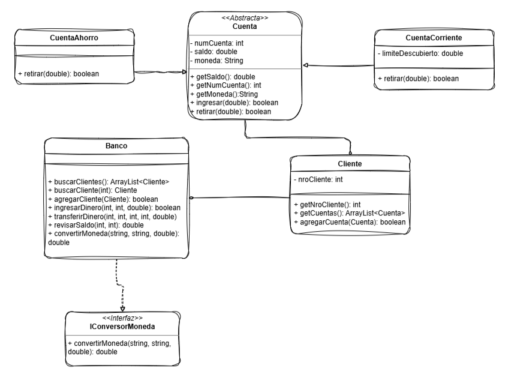

# Documento de Presentación Técnica: Motor Transaccional Alke Wallet

## 1. Resumen Ejecutivo
El proyecto **Alke Wallet** consiste en el diseño y desarrollo del núcleo transaccional (Core Backend) para una solución Fintech digital. El objetivo primordial fue construir un motor financiero en Java capaz de orquestar flujos de dinero entre usuarios, garantizando la consistencia de los datos, la inmutabilidad de los saldos ante errores sistémicos, y el soporte nativo para operaciones multidivisa (CLP, USD, EUR). Todo el ecosistema fue diseñado con un enfoque estricto en la calidad del código y la tolerancia a fallos.

## 2. Arquitectura y Stack Tecnológico
El sistema fue construido prescindiendo de frameworks externos para demostrar un dominio puro de las bases de la ingeniería de software:
* **Lenguaje base:** Java (Paradigma Orientado a Objetos).
* **Testing Framework:** JUnit 5.
* **Patrones Arquitectónicos:** * **Domain-Driven Design (DDD):** El modelo de dominio es rico y encapsulado. Entidades como `CuentaAhorro` y `CuentaCorriente` no son meros contenedores de datos, sino que poseen sus propias reglas de negocio para autorizar o denegar retiros.
  * **Inversión de Dependencias (SOLID):** Se abstrajo la lógica de conversión de divisas mediante interfaces, permitiendo que el orquestador consuma el servicio sin acoplarse.

## 3. Modelo de Dominio y Estructura (UML)
Para dar soporte a la lógica de negocio, se diseñó la siguiente estructura de clases, priorizando la cohesión interna y el bajo acoplamiento:

**Decisiones de Diseño Reflejadas en el Modelo:**
* **Abstracción y Estado Común:** La clase abstracta `Cuenta` centraliza el estado fundamental (como el `saldo` y la `moneda` inyectada desde el constructor) y define el contrato polimórfico del método `retirar(double)`.
* **Especialización (Herencia):** Las clases `CuentaAhorro` y `CuentaCorriente` heredan de `Cuenta`, pero implementan comportamientos transaccionales distintos (ej. el manejo de `limiteDescubierto` exclusivo de la cuenta corriente).
* **Contratos Desacoplados (Interfaces):** La interfaz `IConversorMoneda` define la firma para cruces de divisas. La clase `Banco` firma este contrato, asumiendo la responsabilidad de la conversión sin contaminar a las entidades de dominio con lógica de mercado.
* **Orquestación Centralizada:** La clase `Banco` actúa como el gestor principal, componiendo la relación con los `Cliente`s y encapsulando la complejidad de las transferencias (rollback y validaciones) entre distintas `Cuenta`s.

## 4. Desafíos Estructurales y de Negocio
Durante el ciclo de desarrollo, la arquitectura se enfrentó a escenarios críticos propios de la industria financiera:
1. **La Amenaza de la Concurrencia Lógica:** En transferencias entre cuentas, un fallo en el paso de inyección de fondos (destino) después de un retiro exitoso (origen) amenazaba con destruir fondos o duplicarlos ("dinero en el limbo").
2. **Complejidad Multidivisa y Tasas de Cambio:** Integrar el cobro de *spreads* (impuestos de conversión) en transferencias internacionales, asegurando que si la operación fallaba, el sistema no devolviera montos alterados por la tasa de cambio a la cuenta original.
3. **Manejo de Estados Inválidos:** Proteger la máquina virtual de Java (JVM) de excepciones no controladas como `NullPointerException` al operar sobre clientes o cuentas no registradas.

## 5. Soluciones Implementadas 
Para resolver la complejidad técnica, se adoptaron las siguientes prácticas de nivel de producción:
* **Transacciones Compensatorias (Patrón Rollback):** Se desarrolló un mecanismo de reversión atómica en memoria. Si una transferencia falla en su etapa final, el orquestador recupera el monto original inmutable y ejecuta un depósito de compensación, garantizando que el estado regrese al punto cero.
* **Programación Defensiva (Fail-Fast):** Se implementó una capa de validación temprana. Cualquier parámetro inválido detiene la ejecución inmediatamente lanzando una `IllegalArgumentException`, evitando el procesamiento de datos corruptos.
* **Desarrollo Guiado por Pruebas (TDD):** La lógica fue construida aplicando rigurosamente ciclos de prueba y error. Se diseñaron pruebas de caja negra y clases de equivalencia (transferencias de $0, saldos negativos) para blindar el código contra regresiones.

## 6. Resultados y Entregables Alcanzados
* **Cumplimiento Funcional:** 100% de los casos de uso solicitados fueron desplegados con éxito.
* **Interfaz de Control (CLI):** Se desarrolló un Controlador de Consola interactivo capaz de atrapar excepciones de la capa de negocio (`try-catch`), proporcionando *feedback* al usuario sin interrumpir la ejecución.
* **Código Escalable:** El proyecto entrega una base modular y orientada a objetos, preparada para integrarse en el futuro con bases de datos relacionales o ser expuesta a través de una API RESTful.